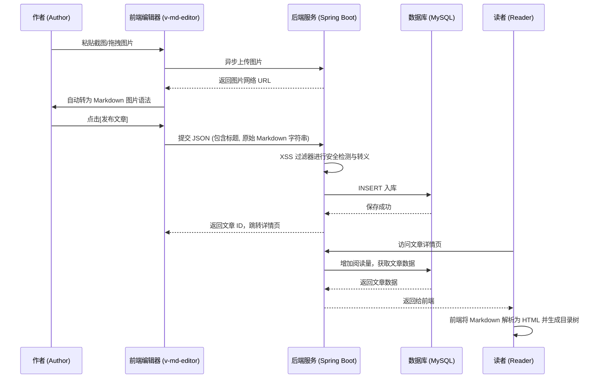

# IT技术博客与知识管理平台 - 详细设计文档

## 1. 项目背景与目标

对于计算机专业的学生和 IT 从业者而言，撰写技术博客、沉淀知识体系是提升核心竞争力的重要手段。传统的图文系统无法良好地支持**代码高亮**、**数学公式**以及**Markdown 极客语法**。本项目旨在开发一个专属于程序员的在线技术社区与个人知识管理平台。

**实训目标：**

1. 掌握 Spring Boot + Vue 3 的前后端分离开发流程。
2. 重点攻克前端 Markdown 编辑器（如 v-md-editor）的深度集成与定制。
3. 学习 Web 安全知识，掌握**防范富文本 XSS 攻击**的常用手段。
4. 掌握**树形/层级数据结构**在数据库表设计中的应用（以评论系统为例）。

## 2. 技术栈选型

- **后端技术：** Java 17 + Spring Boot 3.x + MyBatis-Plus + JWT + Jsoup/Hutool (用于 XSS 过滤)
- **前端技术：** Node.js + Vue 3 (Composition API) + Vite + Element Plus + **v-md-editor / Vditor (Markdown核心库)** + Axios + Pinia
- **数据存储：** MySQL 8.0
- **工具与规范：** Git, Maven, Postman/Apifox

## 3. 功能模块详细设计

系统按照业务逻辑，划分为**前台内容展示与互动端**与**后台内容管理端**。

### 3.1 创作者与读者端 (Front-end)

面向普通用户，提供内容消费与创作的沉浸式体验。

- **门户首页与发现页：**
  - 按“最新发布”、“最多点赞”、“最多阅读”展示文章列表。
  - 提供右侧侧边栏：热门标签云（Tag Cloud）、推荐作者、热门文章排行。
- **Markdown 创作中心 (核心)：**
  - 提供支持实时预览的 Markdown 编辑器。
  - 支持**代码块语法高亮**、快捷插入表格/图片。
  - 支持粘贴/拖拽图片，自动触发上传接口回填 URL。
  - 文章属性设置：选择分类（专栏）、添加标签（如 `Java`, `Spring Boot`）、设置封面图。
- **文章阅读与互动：**
  - Markdown 正文渲染为带样式的 HTML，自动生成右侧**文章目录大纲 (TOC)**。
  - 互动操作：点赞、收藏文章。
  - **评论系统：** 发表评论、回复他人评论，形成层级嵌套。
- **个人主页 (Profile)：**
  - 展示个人基本信息与技术栈简介。
  - 分类查看“我发布的文章”与“我收藏的文章”。

### 3.2 平台后台管理端 (Admin)

管理员主要负责维护社区秩序与基础分类。

- **内容审核与管理：**
  - 查看全站文章列表，支持下架包含违规信息的文章。
  - 评论管理：删除恶意或引战评论。
- **专栏与标签管理：**
  - 维护平台的一级/二级技术专栏（如：前端开发 -> Vue.js）。
  - 维护系统推荐的全局技术标签字典。

## 4. 核心业务流程介绍

### 4.1 文章发布与 XSS 防御流程

1. **内容创作：** 用户在前端 Markdown 编辑器中撰写正文（包含纯文本与 Markdown 标记符）。
2. **图片上传：** 剪贴板粘贴图片时，前端拦截默认行为，调用 `/api/upload` 接口上传至服务器，获取 URL 后自动将 `` 插入编辑器光标处。
3. **提交后端：** 前端将**原始 Markdown 字符串**提交给后端保存。
4. **安全过滤 (核心)：** 后端接收到内容后，虽然存的是 Markdown，但为了防止前端直接渲染恶意脚本（如 ``），需要通过 XSS 过滤工具包剔除危险标签，再存入数据库。
5. **前端渲染：** 读者访问文章页，前端拉取 Markdown 字符串，通过解析引擎转为 HTML 并高亮代码，渲染到页面上。

### 4.2 业务流程图 (时序图)

## 5. 数据库设计

### 5.1 实体关系图 (ER图)

```mermaid
erDiagram
    SYS_USER {
        bigint id PK
        varchar username
        varchar avatar "头像"
        varchar bio "个性签名"
    }

    CATEGORY {
        bigint id PK
        varchar name "专栏名称"
    }

    TAG {
        bigint id PK
        varchar name "标签名称(如 Java)"
    }

    ARTICLE {
        bigint id PK
        varchar title "文章标题"
        text content "Markdown正文"
        bigint author_id FK
        bigint category_id FK
        int view_count "阅读量"
        int like_count "点赞量"
    }

    ARTICLE_TAG {
        bigint article_id PK,FK
        bigint tag_id PK,FK
    }

    COMMENT {
        bigint id PK
        bigint article_id FK
        bigint user_id FK "评论人"
        bigint parent_id FK "父评论ID(回复对象)"
        text content "评论内容"
        datetime create_time
    }

    SYS_USER ||--o{ ARTICLE : "撰写"
    CATEGORY ||--o{ ARTICLE : "归属"
    ARTICLE ||--|{ ARTICLE_TAG : "拥有"
    TAG ||--|{ ARTICLE_TAG : "标记"
    ARTICLE ||--o{ COMMENT : "包含"
    SYS_USER ||--o{ COMMENT : "发表"
    COMMENT ||--o{ COMMENT : "回复 (自关联)"
```

### 5.2 核心数据表结构定义

| **数据表名称**         | **表说明**         | **核心字段定义**                                             |
| ---------------------- | ------------------ | ------------------------------------------------------------ |
| **`busi_article`**     | **文章主表**       | `id`, `title` (标题), `content` (正文, `longtext`类型), `cover_img` (封面图), `author_id`, `category_id`, `view_count`, `like_count`, `status` (0草稿, 1发布) |
| **`busi_tag`**         | **标签字典表**     | `id`, `name` (如 "Spring Boot"), `create_time`               |
| **`busi_article_tag`** | **文章标签中间表** | `article_id`, `tag_id` (多对多关系映射表)                    |
| **`busi_comment`**     | **评论留言表**     | `id`, `article_id` (关联文章), `user_id` (评论者ID), `parent_id` (父评论ID，0表示顶级评论), `reply_to_user_id` (被回复人ID，冗余以提高查询性能), `content` |
| **`busi_like`**        | **点赞记录表**     | `id`, `user_id`, `article_id` (用于限制同一个用户只能点赞一次，并可后期迁移至 Redis) |

## 6. 接口规范示例 (RESTful API)

- `POST /api/upload/image`
  - **说明：** 供 Markdown 编辑器异步上传图片使用，返回稳定的外部链接。
- `POST /api/article/publish`
  - **说明：** 发布文章，需通过 `@RequestBody` 接收包含标签 ID 数组的复杂 JSON 结构。
- `GET /api/article/{id}`
  - **说明：** 详情查询。每次调用需在数据库中将该文章的 `view_count`（阅读量）加 1。
- `GET /api/comment/tree/{articleId}`
  - **说明：** 获取某篇文章的评论树。后端需将扁平的数据库记录组装成具有 `children` 数组的层级 JSON 数据。